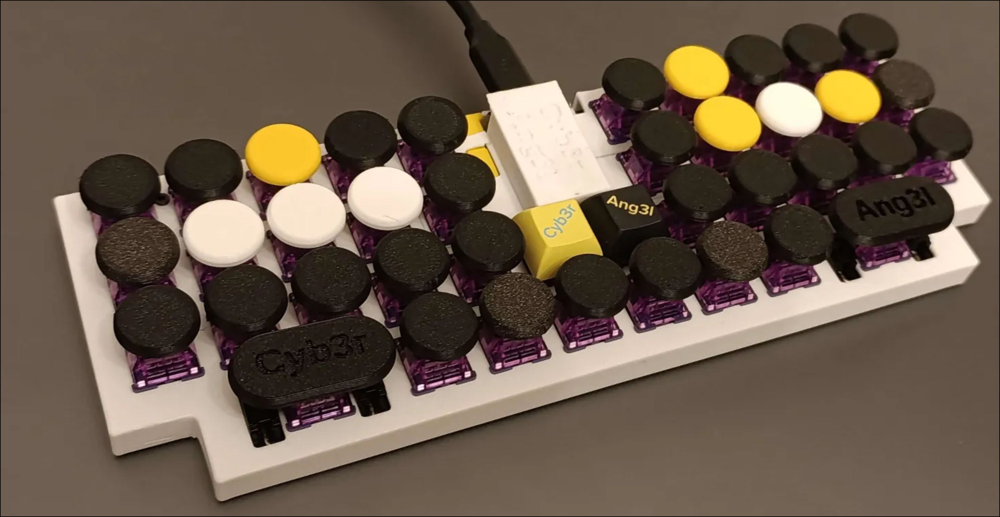

Since Cyb3rAng3l is more of a prototype of the [Hifumil](https://main.kaifireborn.com/keyboards/projects/project.html?id=hifumil) keyboard, the justification for most design decisions can be better found in the respective article. In summary, however, it's the [Kyriel](TODO) layout adapted (by leaving columns out and using conditional layers) to a keyboard that's 10 keys smaller, grid-like and unibody. 

JLPCB sends on at least 5 of the same custom PCB; So why waste it instead of making a whole second keyboard model based on the same'Hifumil' layout?

I decided to go for a cyberpunk-feel typewriter style. The typewriter-like keycaps I found online were all either suspiciously cheap-quality or absurdly overpriced, so I ended up simply 3D printing them with Prusa's PETG - to a much better typing feel than one might expect! This also allowed for more creativity with the palette patterns. In the highlighted keys (according to the Colemak-DH Kyria-like layout), the real name of the web renegade that goes under the name of Cyb3rAng3l is encoded...

I used [Akko Lavender](https://akkogear.de/products/v3-lavender-purple-pro-switch-45pcs) 40g MX switches after falling in love with them on a thrown-together [switch tester](https://main.kaifireborn.com/keyboards/projects/project.html?id=tesil).

Because of some mistakes during the building process itself Cyb3rAng3l ended up a wired keyboard unlike her sister keyboard (luckily ZMK supports this nowadays); Can you spot the patch where the JLC plug was supposed to be?

Dedicated to Nefiel Remi Toh.
