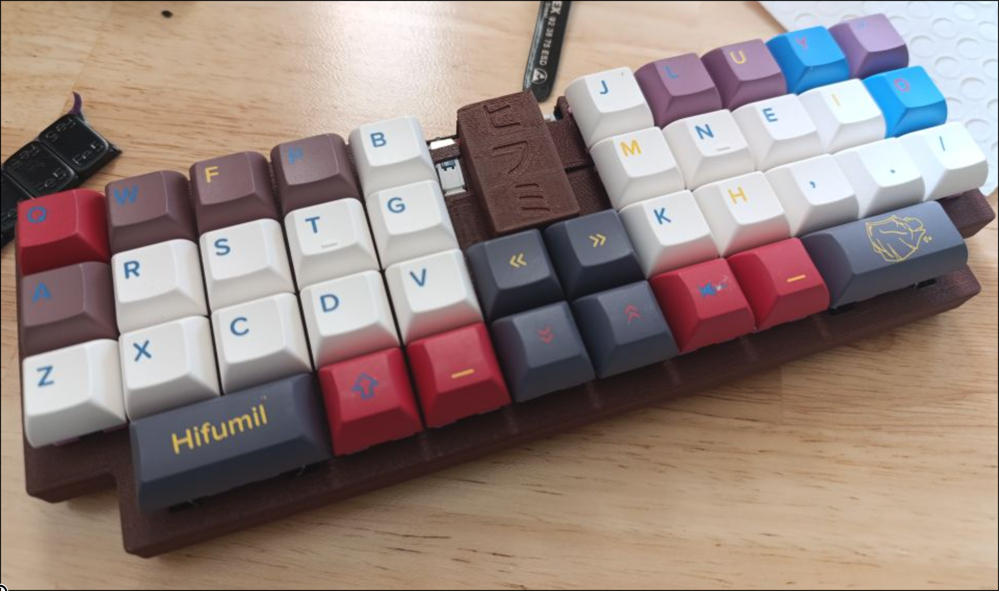
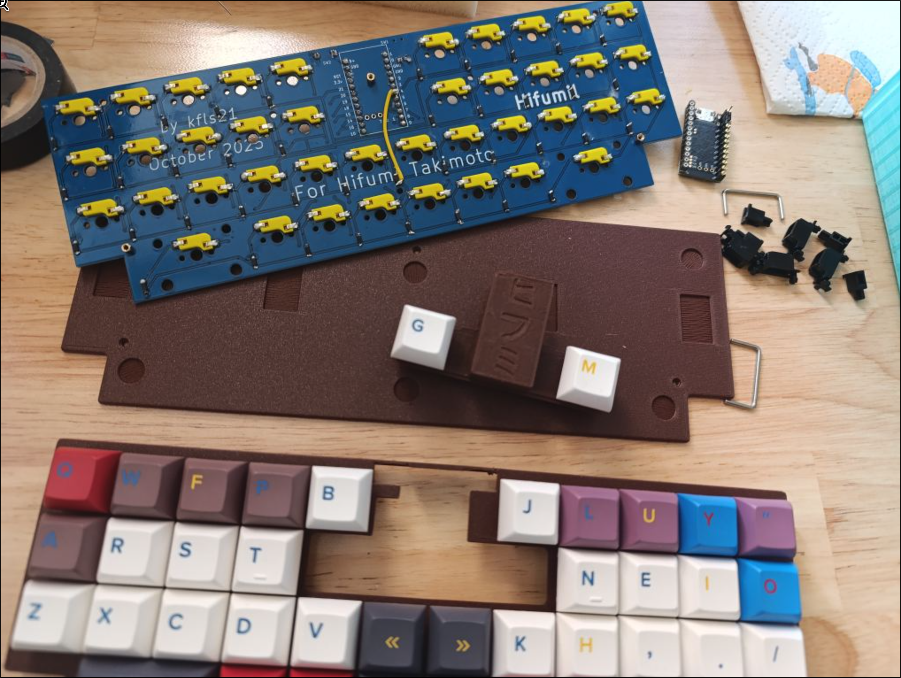

### Main idea

The goal of Hifumil was to come away slightly from the *Kyria* design language without losing too much of the ergonomic advantages, as well as to try out [custom keycaps](https://yuzukeycaps.com/) *Hifumil*.

My *Kyriel* layout is column-staggered with 3 rows (no num- or fn-rows) and 5 columns on each side; There are 8 thumb keys for the many layers and space/backspace/shift, and it uses the [mod-layer system](). The *Hifumil* layout, however is ortholinear, so not staggered at all; the extra columns to the left and right were consolidated into layers: 

### Condensed layer keys
What's more, the 4 keys from the second thumb row and the two outermost thumb keys can can be removed without decreasing the number of layers (to still support the Kyriel-like mod-layer system) by utilizing ZMKs [conditional layer](https://zmk.dev/docs/keymaps/conditional-layers) feature. This way, only the `LMOD`, `NAV`, `SYM` and `RMOD` remain; `FN` is activated when `NAV` and `LMOD` are pressed together; Likewise, `SYM`+`RMOD`=`SYM` and `SYM`+`NAV` = `NUM`. This drastically reduces the number of needed thumb keys.

### Other design decisions

However, I decided to still keep the dedicated `Shift` button on the left side (even though the key is also on the Mod layers) and the second `Space` on the other side; What's more, the `L/R-MOD` buttons are `2u`-wide, both due to both aesthetic and comfort reasons.
Because there was some space under the MCU, I put in two more keys (mapped once again to two of the keys from the removed outer columns), but these aren't strictly necessary and more aesthetic than anything else.

### Technical details
The keycaps are dye-sublimation are custom-printed by YUZU, the case is 3D-Printed with Bambu's "rosewood" filament, and the PCB is custom-designed and ordered from JLPCB. The battery is under the nice!nano-like controller.

The switches are the [Akko V3 Purple Pro](https://akkogear.de/en/products/akko-v3-creamy-purple-pro-switch-45pcs), tactile, 45g).

Dedicated to [Hifumi Takimoto](https://encrypted-tbn0.gstatic.com/images?q=tbn:ANd9GcRORkx_3fO9FXHxmdcww5hn6DyFw08Li1xvyQ&s).